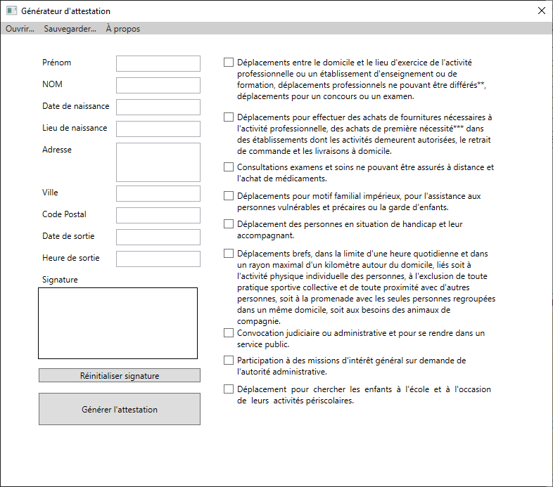

# Introduction

## Attestation Generator

Attestation Generator est un générateur d'attestations dérogatoires. 
Il est basé sur [l'outil](https://media.interieur.gouv.fr/deplacement-covid-19/) du ministère de l'intérieur. 
On y retrouve les mêmes fonctionnalités avec en plus un générateur de signature et une sauvegarde des champs textuels. 
Cet outil est un travail d'étudiant principalement pour apprendre le Framework .NET ainsi que WPF

## Installation

2 choix possibles : l'installer sur votre pc ou bien la version standalone qui n'a pas besoin d'être installée

## Utilisation
Lancez AttestationGenerator.exe

## Documentation

|Nom |Format | 
|:--- |:---- |
|Prénom| Charactère ASCII |
|Nom| Charactère ASCII |
|Date de naissance| JJ/MM/AAAA |
|Lieu de naissance| Charactère ASCII |
|Adresse| Charactère ASCII |
|Ville| Charactère ASCII |
|Code postal| 00000 |
|Date de sortie| JJ/MM/AAAA |
|Heure de sortie| HH:MM |

La signature s'effectue avec la souris  
Vous pouvez cocher autant de cases que souhaité (même 0)  

Pour sauvegarder les champs il faut les avoir préremplis. L'heure de sortie s'actualise au moment où vous chargez un fichier. 

L'attestation générée sera dans le dossier où se trouve le .exe 
Si le gouvernement modifie le pdf il suffit de remplacer **certificate.pdf** qui se trouve dans le dossier d'installation par celui actualisé. 
Si le placement ne convient pas j'effectuerai une mise à jour du programme en conséquence.
